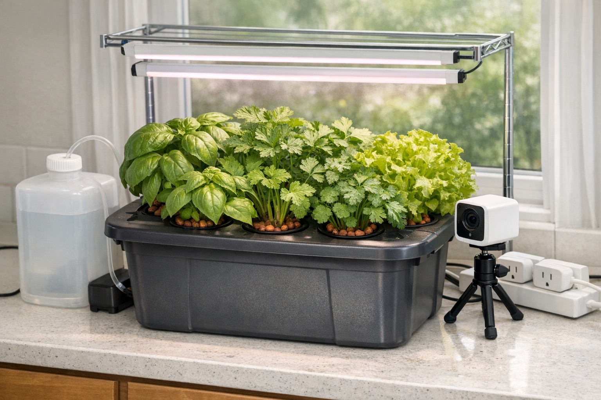

# samogrow 🌿

DIY AI-controlled indoor herb garden — always-fresh parsley and greens.

*AI render of the finished build — a mock-up of the end result, not a photo of a shipped unit.*

An affordable, kit-style alternative to commercial smart gardens (Auk, Click & Grow, Rise Gardens).
The garden device itself is dumb and Wi-Fi-only: smart plugs switch the grow light and the pump,
a Wi-Fi camera watches the plants. The brain — a TypeScript/Bun service calling the Claude API —
runs on a laptop/VM elsewhere, decides watering/lighting, and reports/accepts commands via Telegram.
No Raspberry Pi, no soldering, no GPIO (an on-device Pi controller remains as a documented variant).

## How it works

On a timer during light hours, the brain pulls a camera snapshot, asks Claude for a JSON verdict, toggles the light and pump smart plugs within hard safety caps, and reports on Telegram.

## Repo layout

- `research/` — market and parts research (commercial analogs, hydroponics methods, electronics, software stack)
- `spec/` — the build spec (samospec-style): goal, architecture, BOM with prices, assembly plan, sprint plan
- `software/` — the brain: control loop, camera + AI vision analysis, Telegram bot

Status: research in progress.
