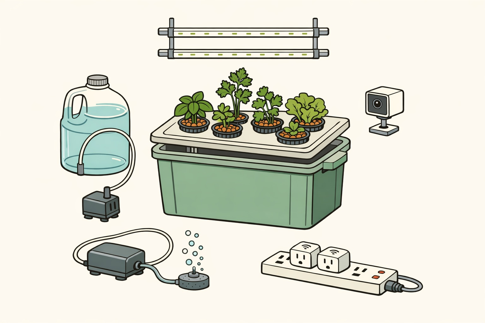

# samogrow by Nombox 🌿

**Self-hosted herbs: a camera, two smart plugs, one Bun service — no subscription, no pods, no black box.**

DIY AI-controlled indoor herb garden — always-fresh herbs and greens: parsley, basil, cilantro, mint, lettuce.



*The build, illustrated — real photos will replace this once the first unit is assembled. (An [AI-generated mock-up](docs/img/hero-mock.jpg) of the finished result also exists — explicitly a render, not a photo.)*

An affordable, kit-style alternative to commercial smart gardens (Auk, Click & Grow, Rise Gardens).
The garden device itself is dumb and Wi-Fi-only: smart plugs switch the grow light and the pump,
a Wi-Fi camera watches the plants. The brain — a TypeScript/Bun service calling the Claude API —
runs on a laptop/VM elsewhere, decides watering/lighting, and reports/accepts commands via Telegram.
No Raspberry Pi, no soldering, no GPIO (an on-device Pi controller remains as a documented variant).

Open source (MIT license). The `software/` service is a small TypeScript/Bun app (`@anthropic-ai/sdk` for Claude vision, `grammY` for Telegram) with a green CI (108 tests). Try the whole loop before ordering any parts — mock mode runs it with zero hardware:

```
SAMOGROW_MOCK=1 bun run src/main.ts
```

## How it works

On a timer during light hours, the brain pulls a camera snapshot, asks Claude for a JSON verdict, toggles the light and pump smart plugs within hard safety caps, and reports on Telegram.


## Repo layout

- `research/` — market and parts research (commercial analogs, hydroponics methods, electronics, software stack)
- `spec/` — the build spec (samospec-style): goal, architecture, BOM with prices, assembly plan, sprint plan
- `software/` — the brain: control loop, camera + AI vision analysis, Telegram bot

Status: spec + shopping list + software ready — see the [project brief](https://nikolays.github.io/samogrow/), [SPEC](spec/SPEC.md), and [shopping list](spec/SHOPPING-LIST.md).

Ready to build? The 10 core V1 items are collected in one [ready-to-order Amazon list](https://www.amazon.com/hz/wishlist/ls/3SF86IUAST80H) (~$216) — cart them in one pass; buy the tote and the plants in person, and the 3" hole saw + 0.1 g scale only if you don't already own them.
