# samogrow — Shopping List (Core Build)

Flat, copy-paste-ready order list for the **no-Pi core build** — a complete working
AI garden. The brain runs on a machine you already own (laptop / mini-PC / VM), so
there is **no controller, no soldering, no wiring** to buy — just two smart plugs, a
Wi-Fi camera, a pump, and the grow side.

Prices are USD, mid-2026; those marked **(est.)** are market-typical estimates from
the research files — verify at the source before buying (expect ±30% from
coupons/sellers). Full rationale is in `spec/SPEC.md` §4.

## Network appliances ("electronics")

| # | Photo | Qty | Item | Est. price | Where / note |
|---|---|---|---|---:|---|
| 1 | 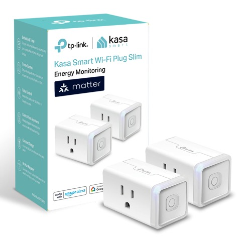 | 1 | [Kasa smart plugs, 2-pack (KP125M, energy monitoring)](https://www.amazon.com/dp/B0BYGRLRS1) | $25 (est.) | also at [kasasmart.com](https://www.kasasmart.com/us/products/smart-plugs/kasa-smart-plug-slim-energy-monitoring-kp125m) — UL-listed, local LAN control; one for the light, one for the pump |
| 2 | 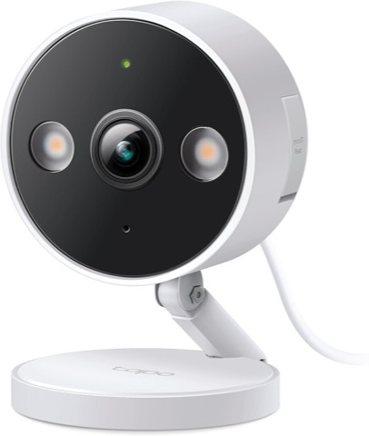 | 1 | [TP-Link Tapo C120 Wi-Fi camera (RTSP)](https://www.amazon.com/dp/B0CH45HPZT) | $25 (est.) | supports local RTSP snapshots; [tp-link.com](https://www.tp-link.com/us/home-networking/cloud-camera/tapo-c120/) |
| 3 | 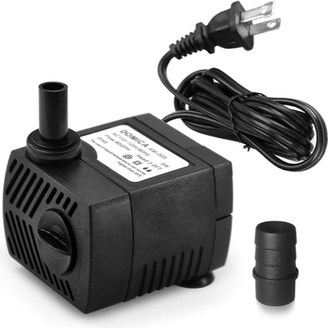 | 1 | [Small 120 V submersible fountain pump (DOMICA 90 GPH)](https://www.amazon.com/dp/B0892DKNR3) | $12 (est.) | switched by the pump plug; timed top-up |
| 4 |  | 1 | [Vinyl tubing for the pump feed (3/8" ID, 10 ft)](https://www.amazon.com/dp/B07NQSNBTG) | $6 (est.) | jug → reservoir |

**Appliance subtotal: ~$68**

## Grow side

| # | Photo | Qty | Item | Est. price | Where / note |
|---|---|---|---|---:|---|
| 5 | 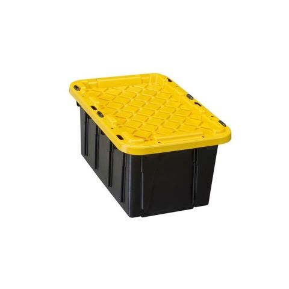 | 1 | [Opaque food-safe tote, ~7 gal (HDX black)](https://www.homedepot.com/p/HDX-7-Gal-Tough-Storage-Tote-in-Black-with-Yellow-Lid-999-7G-HDX/328027039) | $12 (est.) | must be opaque (algae); drill 3" holes |
| 6 | 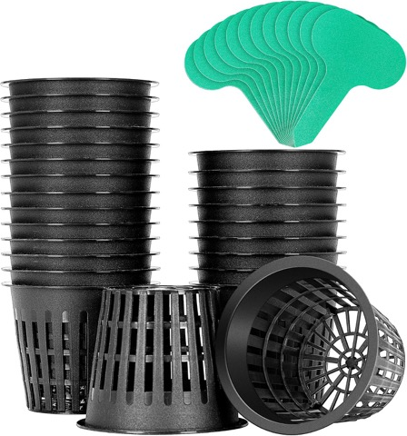 | 1 | [3" net pots, 25-pack (VIVOSUN)](https://www.amazon.com/dp/B07VQVCRWV) | $13 (est.) | Amazon |
| 7 | 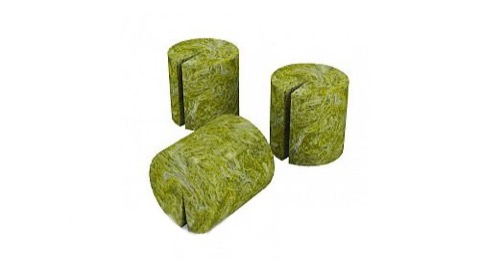 | 1 | [Grodan A-OK 1.5" rockwool plugs, 50 ct](https://www.amazon.com/dp/B071S1DHDQ) | $12 (est.) | Amazon |
| 8 |  | 1 | [Hydroton / LECA clay pebbles, 10 L (made in Germany)](https://www.amazon.com/dp/B01KYYZ9DE) | $20 (est.) | rinse first; reusable |
| 9 | 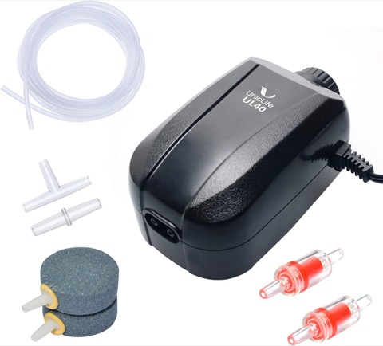 | 1 | [Adjustable aquarium air pump, dual outlet (Uniclife)](https://www.amazon.com/dp/B01EBXI7PG) | $15 (est.) | runs 24/7 on a **dumb** outlet — never a switched plug |
| 10 | 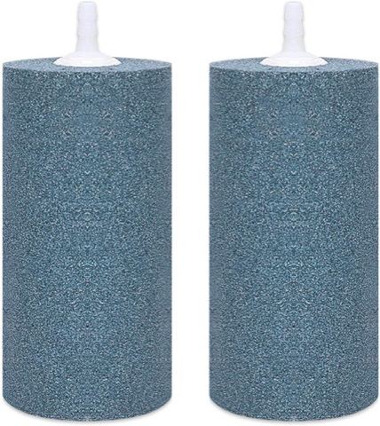 | 1 | [Air stone / disc diffuser, 2-pack (VIVOSUN)](https://www.amazon.com/dp/B01MV5C1I4) | $8 (est.) | Amazon |
| 11 |  | 1 | [Silicone airline 25 ft + check valve (ALEGI kit)](https://www.amazon.com/dp/B08YXF82QB) | $7 (est.) | check valve stops back-siphon |
| 12 |  | 1 | [1–2 gal jug (plain-water top-up feed)](https://www.amazon.com/1-gallon-water-jug-spigot/s?k=1+gallon+water+jug+with+spigot) | $6 (est.) | bounds the worst-case flood (SPEC §9) |
| 13 | 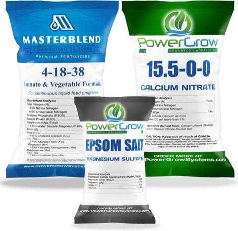 | 1 | [MasterBlend 4-18-38 Combo Kit, 2.5 lb](https://www.amazon.com/dp/B071L15G5Y) | $28 (est.) | makes ~180 gal; mix all 3 parts |
| 14 | 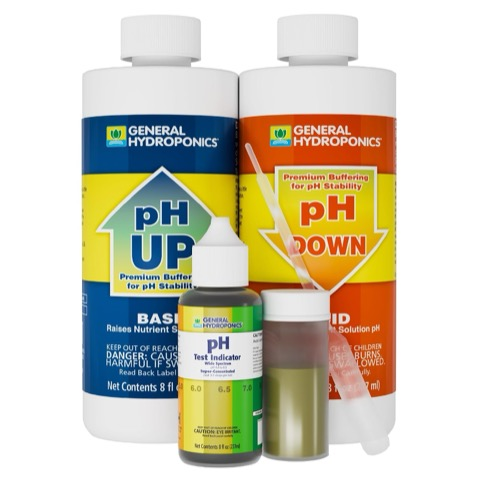 | 1 | [GH pH Control Kit (Up/Down + indicator)](https://www.amazon.com/dp/B000BNKWZY) | $22 (est.) | target pH 5.5–6.5 |
| 15 | 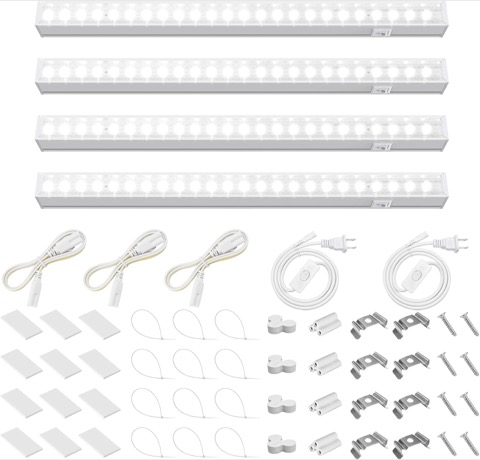 | 1 | [Barrina T5 2 ft full-spectrum strips, 4-pack](https://www.amazon.com/dp/B0BKPF8D8G) | $40 (est.) | ~20 W/strip, linkable, adjustable height |
| 16 | 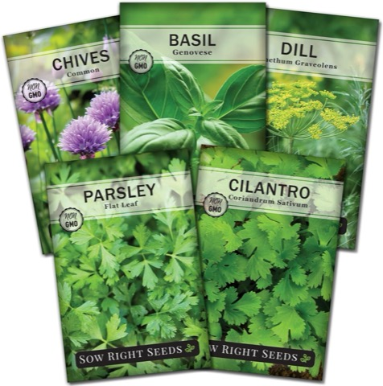 | 1 | [Seed packets: Sow Right 5-herb collection (parsley, basil, cilantro + dill, chives)](https://www.amazon.com/dp/B07CTMVKT9) | $15 (est.) | add a [loose-leaf lettuce packet](https://www.amazon.com/dp/B0BJZ9L9B3) and a live mint cutting |

**Grow-side subtotal: ~$198**

---

## TOTAL (no-Pi core build): **~$266**

Runs on a laptop/VM you already own; **no Raspberry Pi, no soldering, no wiring.**

Optional day-1 add-ons (see `spec/SPEC.md` §4d): second Tapo camera (~$25), timed
dosing pump + plug (~$25), digital pH pen (~$15). Ongoing consumables run
**~$35/yr**; Claude API runs **~$3–7/mo**.

**Order-day reminder:** start parsley seeds the moment they arrive — germination
takes 10–28 days and is the critical-path item. Soak 12–24 h before sowing.
